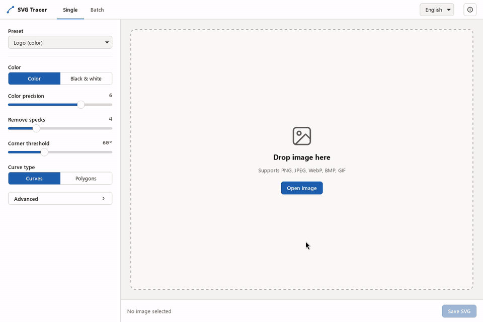

# SVG Tracer

[English](README.md)

SVG Tracer は、PNG、JPEG、WebP、BMP、GIF などのラスター画像を SVG ベクター画像へ変換（トレース）するデスクトップアプリケーションです。
外部のオンライン変換サービスに画像をアップロードすることなく、すべての処理がお使いの PC 上で完結します。



## 主な機能

- **単体変換**: 元画像と変換後 SVG を左右に並べて比較プレビュー。拡大・縮小や表示位置の移動が連動します。パス数やファイルサイズを確認しながらパラメータを調整し、SVG として保存できます。
- **一括変換**: 指定したフォルダ内の対応画像をまとめて変換。複数の CPU コアを活用して高速に並列処理します。出力ファイル名が重複する場合は連番（`name (1).svg` など）を付与して既存ファイルを上書きしません。変換途中のキャンセルにも対応し、不完全なファイルは残りません。
- **プリセット**: 「ロゴ（カラー）」「イラスト（色数少なめ）」「白黒」のプリセットを用意。さらに詳細なパラメータ調整も可能です。
- **多言語対応**: 日本語と英語の UI を切り替え可能。設定は次回起動時にも引き継がれます。
- **外部通信なし**: アプリ自体はネットワーク通信を行いません（テレメトリやアップデート確認もありません）。ただし Windows では、画面の表示に使う Microsoft Edge WebView2 ランタイムが、起動時に自身で Microsoft のサービス（`substrate.office.com`）に接続します。これはアプリから止められません。

## インストール

[Releases](https://github.com/w034ff/SVG-Tracer/releases) ページから、お使いの OS に合わせたインストーラーまたは実行ファイルをダウンロードしてください。

### Windows

- **インストーラー形式**: MSI（`.msi`）および NSIS（`.exe`）を用意しています。どちらも同じフォルダにインストールするので、どちらか一方だけを使ってください。
- **SmartScreen の警告について**: 本アプリはコード署名を行っていないため、初回起動時やインストール時に Windows Defender SmartScreen の警告（「Windows によって PC が保護されました」）が表示される場合があります。その場合は「**詳細情報**」をクリックし、「**実行**」を選択して進めてください。
- **WebView2 ランタイム**: システムに Microsoft Edge WebView2 ランタイムがインストールされていない場合、インストーラーによって自動的に導入されます。

### Linux

- **形式**: AppImage および Debian パッケージ（`.deb`）を用意しています。
- **動作要件**: WebKitGTK 4.1（`libwebkit2gtk-4.1-0` 等）が必要です（Ubuntu 22.04 以降対応）。
- **AppImage**:
  AppImage の実行には FUSE 2 が必要ですが、Ubuntu 22.04 以降には標準で入っていません。先にインストールしてください（Ubuntu 24.04 以降は `libfuse2t64`、22.04 は `libfuse2`）。
  ```bash
  sudo apt install libfuse2t64
  ```
  そのうえで、ダウンロードした AppImage に実行権限を付与して起動してください。
  ```bash
  chmod +x SVG*Tracer_*_amd64.AppImage
  ./SVG*Tracer_*_amd64.AppImage
  ```
- **.deb パッケージ**:
  `apt` を使って依存関係を含めてインストールします。
  ```bash
  sudo apt install ./SVG*Tracer_*_amd64.deb
  ```

## ソースコードからのビルド

### 必要な環境

- **Rust**: stable ツールチェーン
- **Node.js**: `.nvmrc` で指定されているバージョン（v24、または `package.json` の要件 `>=24.15.0`）
- **npm**: 11 以上
- **Linux 依存パッケージ**（Linux 環境でビルドする場合）:
  ```bash
  sudo apt-get update
  sudo apt-get install -y \
    libwebkit2gtk-4.1-dev \
    build-essential \
    curl \
    wget \
    file \
    libxdo-dev \
    libssl-dev \
    libayatana-appindicator3-dev \
    librsvg2-dev \
    patchelf
  ```

### 手順

1. 依存関係のインストール:

   ```bash
   npm ci
   ```

2. 開発モードでの起動:

   ```bash
   npm run tauri dev
   ```

3. リリース用パッケージのビルド:
   ```bash
   npm run tauri build
   ```
   ビルド成果物は `src-tauri/target/release/bundle/` 配下に生成されます。

## ライセンス

本ソフトウェアは [MIT License](LICENSE) のもとで公開されています。

使用している第三者ライブラリのライセンス一覧は、アプリ内の上部バーにある「このアプリについて」ボタンから確認できます。
